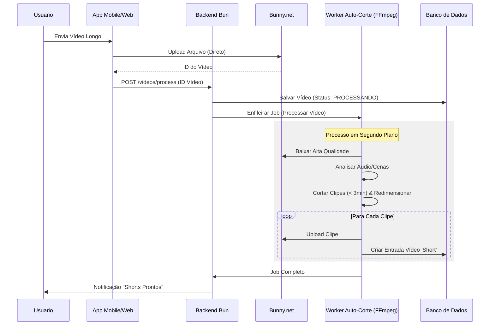

# Arquitetura & Diagramas Lógicos

## 1. Fluxo do Usuário (Navegação do App)
Este diagrama ilustra os caminhos principais de navegação do usuário dentro do App Flutter.

```mermaid
graph TD
    A[Tela de Splash] -->|Checar Auth| B{Está Logado?}
    B -->|Não| C[Tela de Auth]
    B -->|Sim| D[Feed Vertical (Shorts)]
    
    C -->|Login/Registro| D
    
    D -->|Deslizar Esw| E[Tela de Busca]
    D -->|Deslizar Dir| F[Perfil do Usuário]
    D -->|Toque 'Mais'| G[Tela de Upload]
    
    D -->|Toque Link Vídeo Longo| H[Player Vídeo Horizontal]
    H -->|Voltar| D
    
    G -->|Selecionar Vídeo| I[Cortar & Editar]
    I -->|Postar| D
```

## 2. Pipeline de Processamento Automático de Vídeo (Corte Automático)
Este fluxo mostra como um vídeo longo enviado é processado em clipes curtos automaticamente.



## 3. Lógica do Algoritmo de Recomendação
Como o sistema decide qual vídeo mostrar a seguir.

```mermaid
flowchart LR
    A[Usuário Pede Feed] --> B[Buscar Vídeos Candidatos]
    B --> C{Filtrar}
    C -->|Visto recentemente?| D[Descartar]
    C -->|Usuário Bloqueado?| D
    C -->|Passar| E[Motor de Pontuação]
    
    subgraph Pontuacao
    E --> F[Pontuação Base (Popularidade)]
    E --> G[Afinidade Usuário (Tags/Categoria)]
    E --> H[Grafo Social (Amigos Curtiram)]
    F & G & H --> I[Pontuação Total]
    end
    
    I --> J[Ordenar por Pontuação DESC]
    J --> K[Retornar Top 5]
```
