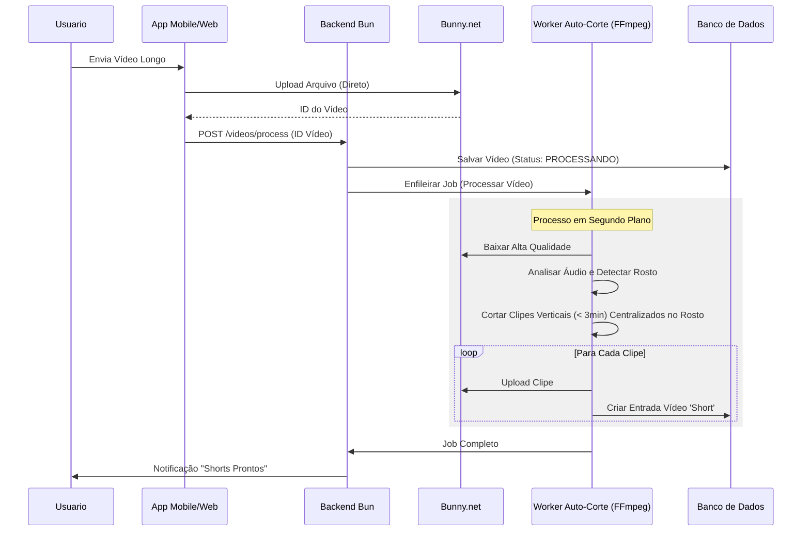

# Documentação Completa do Projeto RHEMA

Este documento agrupa todos os planos, diagramas e checklists para o desenvolvimento do app RHEMA.

---

# 1. Plano de Implementação: App Nativo Flutter & Web

Este plano descreve o desenvolvimento de uma plataforma social de vídeos semelhante ao `modelo-app`, apresentando vídeos curtos (feed), vídeos longos (player horizontal) e processamento automatizado de vídeos.

## Arquitetura de Alto Nível

*   **Frontend**: Flutter (Mobile: iOS/Android, Web: PWA Responsivo).
*   **Backend**: Runtime Bun com framework ElysiaJS.
*   **Banco de Dados**: PostgreSQL (Gerenciado ou Genérico).
*   **ORM**: Prisma (rodando no Bun).
*   **Hospedagem de Vídeo**: Bunny.net Stream (Armazenamento e entrega HLS).
*   **Processamento**: Worker em Segundo Plano (BullMQ) para Algoritmo de Corte Automático (FFmpeg).

## Revisão do Usuário Necessária

> [!IMPORTANT]
> **Custos de Processamento de Vídeo**: O recurso de "Cortes Automáticos" requer processamento no servidor (FFmpeg). Isso efetivamente exige um VPS ou servidor dedicado (ex: Hetzner, AWS EC2), pois funções serverless podem exceder o tempo limite com vídeos longos.

> [!NOTE]
> **Configuração Bunny.net**: Você precisará de um ID de Biblioteca e Chave de API do Bunny.net Stream.

## Mudanças Propostas

### 1. Serviço Backend (Bun + Elysia)

O backend lidará com requisições de API, autenticação de usuário e gerenciamento de vídeos.

#### Design do Esquema (PostgreSQL)
*   **Usuarios**: `id`, `email`, `google_id`, `handle`, `avatar`, `contagem_seguidores`, **interest_vector**.
*   **Videos**: `id`, `usuario_id`, `tipo`, `url`, `duracao`, **embedding**.
*   **Ads (Publicidade)**:
    *   `AdAccount`: Saldo, Status.
    *   `Campaign`: Orçamento_diario, Status, **target_vector** (Embedding do público alvo).
    *   `AdCreative`: Video_url, Title, Action_link, Bid_Amount (Lance).
*   **Interacoes**: `id`, `usuario_id`, `video_id`, `ad_id` (opcional), `tipo`.

#### Endpoints da API
*   `POST /auth/google` (Auth Social)
*   `GET /feed` (Mix de Conteúdo Orgânico + Ads)
*   `POST /ads/campaign` (Criar campanha e definir alvo via texto -> vetor)
*   `POST /ads/creative` (Upload do vídeo do anúncio)
*   `POST /videos/upload` & `/videos/process`

### 2. Algoritmos

#### A. Mecanismo de Recomendação (RAG / Busca Vetorial)
*   **Objetivo**: Abordagem simples e eficiente para MVP usando similaridade semântica.
*   **Tecnologia**: PostgreSQL com extensão `pgvector`.
*   **Lógica**:
    1.  **Embeddings de Vídeo**: Ao enviar um vídeo, gerar um vetor (embedding) baseado no título, descrição e tags (usando OpenAI API ou modelo local como `all-MiniLM-L6-v2`).
    2.  **Perfil do Usuário**: Manter um "Vetor de Interesse" do usuário, que é a média dos vetores dos vídeos que ele curtiu/assistiu.
    3.  **Consulta (RAG)**:
        *   Recuperar o Vetor de Interesse do usuário.
        *   Fazer uma busca por similaridade de cosseno no banco de dados.
        *   Query SQL: `SELECT * FROM videos ORDER BY embedding <=> user_interest_vector LIMIT 10`.
*   **Vantagem MVP**: Não requer manutenção de contadores complexos ou grafos sociais no início. Fácil de ajustar.

#### B. Algoritmo de Corte Automático (Longo -> Shorts)
*   **Objetivo**: Extrair clipes verticais interessantes de <3min de vídeos horizontais longos, **focando no rosto do orador**.
*   **Pipeline**:
    1.  **Entrada**: Vídeo Horizontal 10min+ (16:9).
    2.  **Detecção de Cena**: Usar FFmpeg para encontrar mudanças de cena.
    3.  **Detecção Facial**: Utilizar bibliotecas (ex: OpenCV, MediaPipe ou filtros FFmpeg `cropdetect`) para identificar coordenadas do rosto.
    4.  **Smart Crop Dinâmico**: 
        *   Calcular o bounding box do rosto.
        *   Recortar vídeo para 9:16 mantendo o rosto centralizado (Pan & Scan automático).
    5.  **Atividade de Áudio**: Identificar segmentos com fala.
#### C. Sistema de Publicidade & Leilão (MetaAds Simplificado)
*   **Objetivo**: Inserir anúncios relevantes no feed a cada k slots (ex: a cada 5 vídeos).
*   **Targeting via RAG**:
    *   O anunciante descreve o público alvo: "Amantes de tecnologia e programação".
    *   O sistema gera um `target_vector`.
    *   O sistema busca usuários cujo `user_interest_vector` seja similar ao `target_vector`.
*   **Leilão Simplificado (Real-Time Bidding)**:
    *   Para cada slot de anúncio no feed do Usuário U:
        1.  Selecionar N campanhas candidatas via busca vetorial (RAG).
        2.  Calcular `AdRank = Lance (Bid) * Relevância (Similaridade de Cosseno)`.
        3.  Vencedor é exibido.
        4.  Preço pago = `Lance do 2º lugar + 0.01` (Leilão de Vickrey).

### 3. Aplicativo Flutter (Mobile & Web)

#### Funcionalidades Principais
*   **Autenticação**: Login Social (Google Sign-In apenas).
*   **Feed**: `PageView.builder` (Vertical) para Shorts.
    *   Pré-carregamento de 3 vídeos à frente.
    *   Interface de sobreposição (Corações, Comentários, Compartilhar).
    *   Gestos de deslizar (Direita -> Perfil Usuário, Esquerda -> Busca).
*   **Player**: Widget de Player de Vídeo Compartilhado.
    *   **Shorts**: Loop, Ajuste de capa (Cover fit).
    *   **Longos**: Controles habilitados, suporte a Paisagem.
*   **Upload**:
    *   Seletor de arquivos (Galeria/Câmera).
    *   Interface de Corte (Trim básico no cliente).
    *   Barra de progresso de upload.

#### Módulos (Arquitetura Modular)
*   `core`: DI, Networking, constantes, temas.
*   `features/auth`: Login, Registro.
*   `features/feed`: Lógica do feed vertical.
*   `features/video_details`: Player horizontal.
*   `features/profile`: Perfil do usuário, grade de vídeos.
*   `features/upload`: Câmera, seleção, upload.

---

# 2. Arquitetura & Diagramas Lógicos

## Fluxo do Usuário (Navegação do App)
Este diagrama ilustra os caminhos principais de navegação do usuário dentro do App Flutter.

```mermaid
graph TD
    A[Tela de Splash] -->|Checar Auth| B{Está Logado?}
    B -->|Não| C[Tela de Auth]
    B -->|Sim| D[Feed Vertical (Shorts)]
    
    C -->|Login/Registro| D
    
    D -->|Deslizar Esw| E[Tela de Busca]
    D -->|Deslizar Dir| F[Perfil do Usuário]
    D -->|Toque 'Mais'| G[Tela de Upload]
    
    D -->|Toque Link Vídeo Longo| H[Player Vídeo Horizontal]
    H -->|Voltar| D
    
    G -->|Selecionar Vídeo| I[Cortar & Editar]
    I -->|Postar| D
```

## Pipeline de Processamento Automático de Vídeo (Corte Automático)
Este fluxo mostra como um vídeo longo enviado é processado em clipes curtos automaticamente.



## Lógica do Algoritmo de Recomendação
Como o sistema decide qual vídeo mostrar a seguir.

```mermaid
flowchart LR
    A[Usuário Pede Feed] --> B[Recuperar Vetor do Usuário]
    B --> C[Busca Vetorial (PgVector)]
    C -->|Comparar c/ Embeddings de Vídeos| D[Retornar Mais Similares]
    D --> E[Filtrar (Já Vistos)]
    E --> F[Retornar Lista Final]
```

## Lógica de Leilão de Anúncios (Ad Auction)

```mermaid
flowchart TD
    A[Slot de Anúncio Disponível] --> B[Buscar Campanhas Candidatas (RAG)]
    B --> C{Candidatos > 0?}
    C -->|Não| D[Mostrar Vídeo Orgânico]
    C -->|Sim| E[Calcular AdRank]
    E --> F[AdRank = Bid * Similaridade]
    F --> G[Ordenar por AdRank DESC]
    G --> H[Selecionar Vencedor]
    H --> I[Exibir Anúncio]
```

---

# 3. Cronograma Mestre de Desenvolvimento (Checklist Completo)

Este arquivo contém todas as etapas detalhadas para o desenvolvimento do projeto RHEMA (App Flutter + Backend Bun + Vídeos), organizado cronologicamente.

## FASE 1: Configuração & Arquitetura Inicial
- [x] **Configuração do Ambiente**
    - [x] Instalar Bun (Runtime Backend)
    - [x] Instalar Flutter SDK (Stable Channel)
    - [x] Configurar Banco de Dados PostgreSQL Local
    - [x] Criar conta/projeto na Bunny.net (Stream)
- [x] **Inicialização do Projeto (Repositórios)**
    - [x] Criar monorepo ou repositórios separados (backend/mobile)
    - [x] Inicializar projeto Bun (`bun init`)
    - [x] Inicializar projeto Flutter (`flutter create`)
    - [x] Configurar Git e `.gitignore`
    - [x] **Configurar Cloudflare Tunnel** (Para expor localhost ao emulador/dispositivo externo)

## FASE 2: Backend (Bun + Elysia) & Banco de Dados
- [x] **Banco de Dados (Prisma & Postgres)**
    - [x] Instalar Prisma ORM
    - [x] **Configurar Supabase (Migração Cloud)**
    - [x] Definir Schema `User` (id, email, senha, perfil, **interest_vector**)
    - [x] Definir Schema `Video` (id, url, status, duração, **embedding**)
    - [x] Definir Schema `Interaction` (likes, views)
    - [x] Rodar migração inicial (`prisma db push`) e Seed
- [ ] **API de Autenticação (Google Only)**
    - [ ] Instalar biblioteca de validação Google Auth(utilizar firebase para autenticação)
    - [ ] Endpoint `POST /auth/google`:
        - [ ] Validar ID Token do Google
        - [ ] Verificar se email existe no Banco
        - [ ] Criar usuario se não existir (Auto-register)
        - [ ] Retornar JWT da aplicação
    - [ ] Middleware de Proteção de Rotas (Validar JWT App)
- [x] **API de Vídeos (Básico)**
    - [x] Endpoint `POST /videos/upload` (Gerar Assinatura Bunny.net)
    - [x] Endpoint `GET /feed` (Lista simples inicial)
    - [x] Endpoint `GET /videos/:id` (Detalhes)

## FASE 3: Infraestrutura de Vídeo & Processamento (Cortes)
- [x] **Integração Bunny.net**
    - [x] Configurar credenciais (Library ID: 563955, CDN: vz-2322c3c2-fde.b-cdn.net)
    - [ ] Configurar Webhooks (Vídeo processado, Falha)
    - [x] Serviço de Upload via API (TUS Protocol)
- [x] **Worker de Processamento (FFmpeg & AI)**
    - [x] Configurar sistema de fila (DB-based, BullMQ para produção)
    - [x] Criar script de detecção de cenas com FFmpeg
    - [ ] **Implementar Detecção Facial** (OpenCV/TensorFlow Lite ou API externa)
    - [x] Criar lógica de "Smart Crop" básica (centralizado)
    - [x] Implementar pipeline: Download -> Cortar Vertical -> Upload Clipe
- [x] **API de Cortes**
    - [x] Endpoint `POST /videos/process` (Recebe ID vídeo longo)
    - [x] Endpoint `GET /videos/process/:id/status` (Status do processamento)
    - [x] Lógica para salvar os "Shorts" gerados no Banco de Dados

## FASE 4: Algoritmo de Recomendação (Vetorial/RAG)
- [x] **Sistema de Embeddings**
    - [x] Escolher modelo de embedding (Local `@xenova/transformers` - all-MiniLM-L6-v2)
    - [x] Criar função para gerar embedding ao salvar vídeo (`AIService`)
    - [x] Criar função para atualizar vetor do usuário ao interagir
    - [x] **Pesos diferenciados por tipo de interação:**
        - Like: 10% (atração)
        - Share: 15% (atração - sinal forte)
        - Save: 8% (atração)
        - View >80%: 3% (atração)
        - Skip <20%: -5% (repulsão - afasta do conteúdo)
- [x] **Endpoint de Feed Inteligente**
    - [x] Implementar query raw com Prisma (`ORDER BY embedding <=> user_vector`)
    - [x] Tabs "Sugeridos" (IA) vs "Seguindo" (cronológico)
    - [x] Otimizar indexação no Postgres (IVFFlat)

## FASE 5: Desenvolvimento Mobile (Flutter)
- [x] **Estrutura Base**
    - [x] Configurar Temas e Cores (Design System)
    - [x] Configurar Navegação (GoRouter ou AutoRoute)
    - [x] Configurar Gerenciamento de Estado (Riverpod/Bloc)
- [ ] **Autenticação UI**
    - [x] Temas, Cores e Fontes (Google Fonts)
    - [x] Bottom Navigation Bar com animações
    - [x] Gerenciamento de Estado (Riverpod)
- [x] **Autenticação (Frontend)**
    - [x] Tela de Login (Design)
    - [x] Botão "Entrar com Google" (UI)
- [x] **Feed Horizontal (TikTok Style)**
    - [x] Widget `VideoPlayer` (player otimizado)
    - [x] `PageView` horizontal e vertical
    - [x] Overlay de informações (Título, User, Ações)
    - [x] Conectar ao endpoint `GET /feed`
    - [x] Fallback para Mock Data se offline
    - [x] **Pré-carregamento de Vídeos** (próximos 2 vídeos carregados em background para reprodução instantânea)
- [x] **Upload de Vídeo**
    - [x] Seleção de arquivo da galeria
    - [x] **Gravação de Vídeo (Câmera)**
    - [x] **UI Premium na Tela de Upload**
    - [x] Upload direto (Via Backend Proxy/Dio)
    - [x] Barra de progresso real
    - [x] Enviar metadados para Backend

## FASE 6: Web App (Flutter Web)
- [ ] **Adaptação Responsiva**
    - [ ] Layout grid para Desktop (Feed não é tela cheia)
    - [ ] Navegação lateral (Sidebar) para telas grandes
- [ ] **Otimização Web**
    - [ ] Configurar renderizador Canvas/HTML
    - [ ] SEO Básico (Meta tags dinâmicas no index.html se possível ou SSR wrapper)

## FASE 7: Social & Polimento
- [x] **Interações**
    - [x] Implementar Curtir (UI Otimista + Backend + Atualiza Vetor)
    - [x] Implementar Comentários (UI & Controller implementados)
    - [x] Implementar Compartilhar (UI + Backend + Atualiza Vetor)
    - [x] Implementar Salvar (UI + Backend + Atualiza Vetor)
    - [x] Implementar Perfil de Usuário (Lista de vídeos publicados)
- [ ] **Testes & QA**
    - [ ] Teste de Carga no Backend
    - [ ] Teste de Usabilidade no App
    - [x] **Performance de Vídeo** (Preload implementado - reprodução instantânea ao deslizar)

## FASE 9: Sistema de Publicidade (Ads Lite)(Gerenciamento de Anúncios Apenas Web)
- [ ] **Backoffice de Anunciantes**
    - [ ] Criar tabela `AdAccounts` e `Campaigns`
    - [ ] Endpoint para Criar Campanha (Gerar embedding do target)
    - [ ] Interface Web para Anunciante (Dashboard simples)
- [ ] **Engine de Leilão**
    - [ ] Implementar lógica de seleção de Ads no `GET /feed`
    - [ ] Calcular AdRank (Bid * Similaridade)
    - [ ] Registrar Impressão e Clique (Cobrança)

## FASE 10: Deploy
- [ ] **Backend Deploy**
    - [ ] Configurar Dockerfile para Bun
    - [ ] Deploy em VPS/Cloud
- [ ] **App Stores**
    - [ ] Gerar APK/AAB Assinado (Android)
    - [ ] Configurar projeto Xcode (iOS)
    - [ ] Deploy Web (Vercel/Netlify/Firebase Hosting)
?