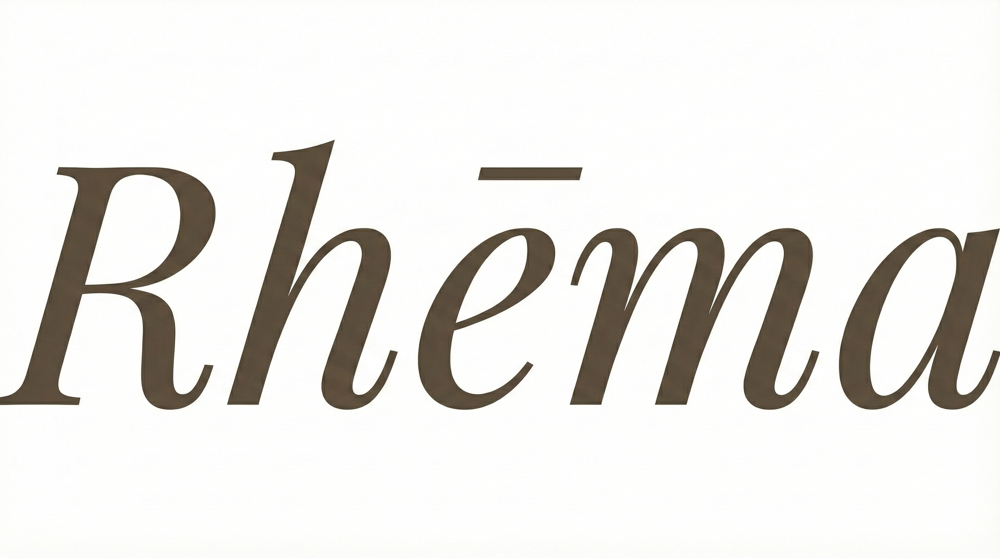

# RHEMA - Plataforma Social de Vídeos Cristãos



## 📱 Sobre o Projeto

**RHEMA** (Ρῆμα - "Palavra revelada" em grego) é uma plataforma social de vídeos curtos e longos voltada para a comunidade cristã. Inspirada no TikTok/Reels, permite compartilhar testemunhos, louvores, estudos bíblicos e conteúdo edificante.

## 🏗️ Arquitetura

### Stack Tecnológico

| Camada | Tecnologia |
|--------|------------|
| **Mobile** | Flutter (iOS, Android, Web) |
| **Backend** | Bun + ElysiaJS |
| **Banco de Dados** | PostgreSQL + pgvector |
| **ORM** | Prisma |
| **Vídeo Hosting** | Bunny.net Stream |
| **Processamento** | FFmpeg + BullMQ |

### Estrutura de Diretórios

```
RHEMA/
├── 📁 backend/              # API Backend (Bun + Elysia)
│   ├── src/
│   │   ├── routes/          # Rotas da API
│   │   ├── lib/             # Utilitários
│   │   └── index.ts         # Entry point
│   ├── prisma/
│   │   └── schema.prisma    # Modelo de dados
│   └── package.json
│
├── 📁 mobile/               # App Flutter
│   ├── lib/
│   │   ├── core/            # Tema, Router, Network
│   │   └── features/        # Módulos por feature
│   │       ├── auth/        # Autenticação
│   │       ├── feed/        # Feed vertical
│   │       ├── profile/     # Perfil
│   │       ├── search/      # Busca
│   │       ├── upload/      # Upload de vídeo
│   │       └── video/       # Player de vídeo
│   ├── assets/              # Imagens, ícones, fontes
│   └── pubspec.yaml
│
├── 📁 DOCUMENTAÇÃO/         # Documentação do projeto
├── 📁 IMAGENS/              # Logo e ícones base
└── 📁 modelo-app/           # App de referência (React)
```

## 🚀 Começando

### Pré-requisitos

- **Bun** (>= 1.0) - [Download](https://bun.sh)
- **Flutter** (>= 3.5) - [Download](https://flutter.dev)
- **PostgreSQL** (>= 14)
- **Redis** (para filas de processamento)

### Configuração do Backend

```bash
# Entrar no diretório
cd backend

# Instalar dependências
bun install

# Configurar variáveis de ambiente
cp .env.example .env
# Editar .env com suas credenciais

# Rodar migrações do banco
bun run db:migrate

# Iniciar servidor de desenvolvimento
bun run dev
```

### Configuração do Mobile

```bash
# Entrar no diretório
cd mobile

# Instalar dependências
flutter pub get

# Rodar no dispositivo/emulador
flutter run
```

## 🎨 Design System

### Paleta de Cores

| Cor | Hex | Uso |
|-----|-----|-----|
| **Rhema Gold** | `#D4AF37` | Accent, CTAs |
| **Primary 800** | `#3D382F` | Texto principal |
| **Primary 50** | `#F7F6F4` | Background claro |
| **Feed Black** | `#000000` | Background do feed |

### Tipografia

- **Display/Títulos**: Playfair Display (Serif, Italic)
- **Body/UI**: Plus Jakarta Sans

## 📋 Features

### MVP (Fase 1-5)

- [x] Estrutura do projeto
- [x] Design System e Tema
- [x] Tela de Splash
- [x] Autenticação (Google Sign-In)
- [x] Feed Vertical (Shorts)
- [x] Player Horizontal (Vídeos Longos)
- [x] Perfil de Usuário
- [x] Busca de Conteúdo
- [x] Upload de Vídeo
- [ ] Backend completo
- [ ] Integração com API

### Fase 2 (6-7)

- [ ] Sistema de Comentários
- [ ] Follow/Unfollow
- [ ] Notificações Push
- [ ] Web App Responsivo

### Fase 3 (8-10)

- [ ] Algoritmo de Recomendação (pgvector)
- [ ] Corte Automático (FFmpeg)
- [ ] Sistema de Ads
- [ ] Deploy Production

## 🔌 Endpoints da API

### Autenticação
- `POST /auth/google` - Login com Google
- `GET /auth/me` - Dados do usuário atual

### Feed
- `GET /feed` - Feed de vídeos (shorts)
- `GET /feed/long` - Vídeos longos
- `GET /feed/search` - Busca

### Vídeos
- `POST /videos/upload` - Iniciar upload
- `POST /videos/:id/confirm` - Confirmar upload
- `GET /videos/:id` - Detalhes do vídeo

### Interações
- `POST /interactions/like` - Curtir
- `POST /interactions/view` - Registrar view
- `POST /interactions/comment` - Comentar

## 📝 Licença

Projeto privado - Todos os direitos reservados.

---

**Rhēma** - *Conectando em Espírito* ✝️
